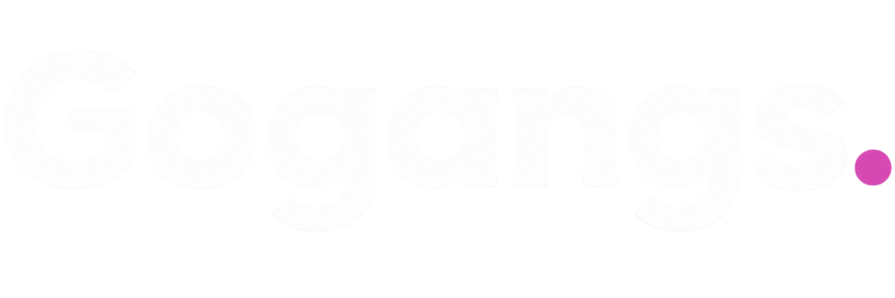
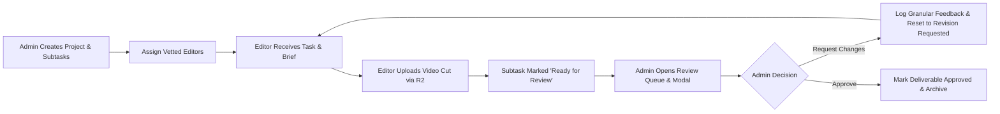

# Gogangs — Next-Gen Video Production & Editor Management Platform

<p align="center">
  
</p>

<p align="center">
  <strong>A streamlined, end-to-end video editing pipeline connecting top-tier video editors with creative studios and agencies.</strong>
</p>

<p align="center">
  
  
  
  
  
  
  
</p>

---

## 📌 Table of Contents
1. [Overview](#-overview)
2. [Key Portals & Features](#-key-portals--features)
   - [1. Landing & Onboarding Screen](#1-landing--onboarding-screen)
   - [2. Admin Management Portal](#2-admin-management-portal)
   - [3. Editor Workspace Portal](#3-editor-workspace-portal)
3. [End-to-End Workflow Architecture](#-end-to-end-workflow-architecture)
4. [Tech Stack](#-tech-stack)
5. [Project Directory Structure](#-project-directory-structure)
6. [Cloudflare R2 Storage & Quota Engine](#-cloudflare-r2-storage--quota-engine)
7. [Getting Started](#-getting-started)
   - [Prerequisites](#prerequisites)
   - [Installation](#installation)
   - [Environment Variables Configuration](#environment-variables-configuration)
   - [Running the Application](#running-the-application)
8. [API Endpoints Reference](#-api-endpoints-reference)
9. [Design System & Responsive Ergonomics](#-design-system--responsive-ergonomics)
10. [License](#-license)

---

## 🚀 Overview

**Gogangs** is a modern video production management platform built to solve the fragmentation in video agency workflows. It replaces chaotic Google Drive links, messy Slack threads, and unorganized email reviews with a single cohesive workspace featuring:

- **100% Direct File/Video Submissions** with frame-accurate version history (`v1`, `v2`, etc.).
- **1GB High-Speed Cloudflare R2 Storage** allocated per editor with live quota enforcement.
- **Dedicated Admin & Editor Portals** with role-based routing and automated subtask assignments.
- **Interactive Review Queue** with modal file inspectors, version changelogs, and inline feedback logs.
- **Fully Responsive & Fluid UI** engineered for desktop workstations, tablets, and mobile devices.

---

## 🖥️ Key Portals & Features

### 1. Landing & Onboarding Screen
- **Modern Minimalist Aesthetics**: Seamless neutral background (`#f4f6fb`) matching internal portals with crisp typography.
- **3D Floating Hero Cards**: Interactive card deck highlighting featured video specialists and top-rated creators.
- **Curated Showreel Showcase**: 7 video genre showreels (Cinematic 4K, Commercials, 3D Motion, Viral Shorts, etc.).
- **Workflow Highlights**: Clear 3-step value proposition explaining booking, 1GB workspace collaboration, and delivery approvals.

### 2. Admin Management Portal
- **KPI Metrics Dashboard**: Live snapshot of active projects, editor utilization rate, pending reviews, and monthly revenue.
- **Project & Subtask Creator**: Build structured client projects with granular deliverables, deadlines, and task categories.
- **Smart Editor Assignment**: Filter editors by specialization (Premiere Pro, DaVinci Resolve, After Effects), rating tier, and workload capacity.
- **Interactive Review Queue**:
  - Filterable KPI summary cards (Total Submissions, Ready for Review, Revisions Requested, Approved).
  - Search and filter by client, editor, and deliverable status.
  - **Submission Queue & Files Modal**: Inspect submitted files, view file sizes in MB, download deliverables, compare version history, and log timestamped admin feedback.
- **Editor Verification & Roster Management**: Verify editor credentials, review submitted portfolio reels, and manage editor accounts.
- **Reports & Financial Overview**: Track on-time turnaround rate, average revision rounds, and editor payout balances.

### 3. Editor Workspace Portal
- **Editor Task Radar**: View assigned subtasks, countdown timers, client briefs, and reference materials.
- **Direct File Submissions**:
  - Upload videos directly via drag-and-drop or file selector.
  - Automatically records file size in MB and increments deliverable version tags.
  - Add version comments explaining creative edits and updates.
- **Admin Feedback Viewer**: Read granular revision notes and instructions directly on the project card and modal.
- **1GB Storage Manager**:
  - Real-time visual progress bar tracking used vs. remaining storage.
  - Asset management table with file deletion to free up space.
  - Direct S3/R2 presigned upload pipeline.
- **Portfolio & Profile Management**: Edit bio, software proficiency, hourly rates, social links, and showcase featured video clips.

---

## 🔄 End-to-End Workflow Architecture



### Deliverable Status Lifecycle:
1. `Assigned` — Editor assigned to subtask; brief accessible.
2. `In Progress` — Editor actively working in editing suite.
3. `Ready for Review` — Editor uploads video file to the submission queue.
4. `In Review` — Admin actively reviewing submitted cut and audio mix.
5. `Revision Requested` — Admin logged timestamped feedback requiring an update cut (`v2`).
6. `Approved` — Deliverable cleared for final client delivery.

---

## 🛠️ Tech Stack

### Frontend
- **Framework**: [React 18](https://react.dev/) + [TypeScript](https://www.typescriptlang.org/)
- **Bundler & Dev Server**: [Vite 5](https://vitejs.dev/)
- **Styling**: [Tailwind CSS 3](https://tailwindcss.com/) with customized elevation shadows, pill badges, and glassmorphism.
- **Iconography**: [Lucide React](https://lucide.dev/) (consistent stroke width and sleek micro-interactions).
- **State Management**: React Context API (`useApp`) with persistent in-memory and Supabase state synchronization.

### Backend & Cloud Storage
- **Server**: [Node.js](https://nodejs.org/) & [Express 5](https://expressjs.com/)
- **Object Storage**: [Cloudflare R2](https://www.cloudflare.com/products/r2/) via `@aws-sdk/client-s3` & `@aws-sdk/s3-request-presigner` for zero-egress fee direct uploads.
- **Database**: [Supabase](https://supabase.com/) (PostgreSQL) with fallback mock data store for offline development.

---

## 📂 Project Directory Structure

```text
Gogangs/
├── server/                         # Express Backend & Storage Engine
│   ├── data.js                     # Seed data (projects, editors, storage assets)
│   ├── index.js                    # REST API endpoints (health, storage, projects, reviews)
│   └── r2.js                       # Cloudflare R2 / S3 client & presigned URL generator
├── src/                            # React Frontend Source
│   ├── assets/                     # Static assets (logos, branding)
│   ├── components/                 # Reusable UI Components
│   │   ├── Logo.tsx                # Brand logo component
│   │   ├── TopNav.tsx              # Portal navigation bar with role switching & alerts
│   │   └── ui.tsx                  # Shared buttons, modals, badges, inputs
│   ├── screens/                    # Page Views & Modules
│   │   ├── AdminDashboard.tsx      # Admin overview with KPIs and summaries
│   │   ├── AssignEditors.tsx       # Editor assignment hub
│   │   ├── CreateProject.tsx       # Project and subtask creation wizard
│   │   ├── EditorDashboard.tsx     # Editor home dashboard and task radar
│   │   ├── EditorDetail.tsx        # In-depth editor profile and performance view
│   │   ├── EditorManagement.tsx    # Admin editor roster table and status management
│   │   ├── EditorPortfolio.tsx     # Editor portfolio showcase
│   │   ├── EditorProfile.tsx       # Editor settings and account info
│   │   ├── EditorProjects.tsx      # Editor project list, file uploader modal & feedback
│   │   ├── EditorStorageManager.tsx# 1GB Cloudflare R2 storage manager
│   │   ├── EditorVerification.tsx  # Verification and KYC auditing
│   │   ├── LandingPage.tsx         # Modern landing & onboarding page
│   │   ├── LoginPage.tsx           # Authentication screen (Admin & Editor login)
│   │   ├── ProjectDetail.tsx       # Granular project breakdown & deliverable table
│   │   ├── ProjectsOverview.tsx    # Admin project management list
│   │   ├── PublicPortfolioPage.tsx # Publicly sharable creator portfolio
│   │   ├── Reports.tsx             # Financial, performance, and throughput reports
│   │   └── ReviewQueue.tsx         # Responsive review queue & submission modal
│   ├── context.tsx                 # Global application state and dispatchers
│   ├── data.ts                     # Initial frontend mock datasets
│   ├── types.ts                    # TypeScript interfaces (Project, Subtask, Submission, Editor)
│   ├── App.tsx                     # Route management and application wrapper
│   ├── main.tsx                    # React DOM entrypoint
│   └── index.css                   # Tailwind styles and custom keyframe animations
├── .env                            # Environment variables (R2, Supabase, API ports)
├── package.json                    # Project dependencies and npm scripts
├── tsconfig.json                   # TypeScript configuration
├── tailwind.config.js              # Tailwind theme, typography, and palette configuration
└── vite.config.ts                  # Vite build tool configuration
```

---

## ☁️ Cloudflare R2 Storage & Quota Engine

Every editor registered on Gogangs is allocated **1 GB (1,073,741,824 bytes)** of cloud storage:

1. **Pre-flight Quota Validation**: When an upload is initiated, the backend verifies `(currentUsageBytes + fileSizeBytes) <= storageLimitBytes`.
2. **Direct-to-R2 Upload**: If quota permits, the backend generates an S3 Presigned `PUT` URL valid for 15 minutes.
3. **Zero-Server-Load Transfer**: Files stream directly from the browser to Cloudflare R2 without burdening the Express API server.
4. **Instant Confirmation**: Once completed, the frontend confirms the asset, attaching the public URL, file size, version number, and comments to the deliverable subtask.

---

## ⚡ Getting Started

### Prerequisites
- [Node.js](https://nodejs.org/) (v18.0.0 or higher recommended)
- [npm](https://www.npmjs.com/) (v9.0.0 or higher)

### Installation

1. **Clone the repository**:
   ```bash
   git clone https://github.com/rishidar-27/Editorsden.git
   cd Editorsden
   ```

2. **Install dependencies**:
   ```bash
   npm install
   ```

### Environment Variables Configuration

Create a `.env` file in the root directory:

```env
# Server Configuration
PORT=5000
VITE_API_URL=http://localhost:5000

# Cloudflare R2 Object Storage (Optional for local mock mode)
R2_ACCOUNT_ID=your_cloudflare_account_id
R2_ACCESS_KEY_ID=your_r2_access_key
R2_SECRET_ACCESS_KEY=your_r2_secret_access_key
R2_BUCKET_NAME=gogangs-deliverables
R2_PUBLIC_DOMAIN=media.gogangs.com

# Supabase PostgreSQL Database (Optional for local mock mode)
VITE_SUPABASE_URL=your_supabase_project_url
VITE_SUPABASE_ANON_KEY=your_supabase_anon_key
```

> **Note**: The application includes self-contained resilient fallback stores. If Cloudflare R2 or Supabase credentials are not provided, all upload and review flows operate smoothly in mock demonstration mode.

### Running the Application

1. **Start the Express API Backend**:
   ```bash
   npm run server
   ```
   *Runs at `http://localhost:5000` (Health check at `http://localhost:5000/api/health`).*

2. **Start the Vite Dev Server**:
   ```bash
   npm run dev
   ```
   *Runs at `http://localhost:5173`.*

3. **Typecheck & Code Integrity**:
   ```bash
   npm run typecheck
   ```

4. **Production Build**:
   ```bash
   npm run build
   ```

---

## 📡 API Endpoints Reference

| Method | Endpoint | Description |
| :--- | :--- | :--- |
| `GET` | `/api/health` | System health check, uptime, memory, and storage configuration. |
| `POST` | `/api/storage/presigned-upload-url` | Validates 1GB quota and generates direct S3 upload URL. |
| `POST` | `/api/storage/confirm-upload` | Confirms upload completion, attaches deliverable to subtask. |
| `GET` | `/api/storage/usage/:editorId` | Fetches storage consumption and asset breakdown for an editor. |
| `DELETE` | `/api/storage/assets` | Deletes selected assets from R2 storage to reclaim space. |
| `GET` | `/api/projects` | Retrieves list of all active projects and nested subtasks. |
| `POST` | `/api/projects` | Creates a new project with milestone deliverables. |
| `POST` | `/api/reviews/:subtaskId/decision` | Submits admin decision (`Approved` or `Revision Requested`) with feedback. |

---

## 🎨 Design System & Responsive Ergonomics

- **Color Palette**:
  - `Background`: `#f4f6fb` (soft cool-gray workspace canvas)
  - `Cards & Surfaces`: `#ffffff` with subtle borders (`border-gray-200/80`)
  - `Typography`: Clean high-contrast neutral scale (`text-gray-900`, `text-gray-600`, `text-gray-500`)
  - `Brand Accents`: Deep Indigo (`#3b28cc`), Vibrant Amber (`#f59e0b`), Emerald Green (`#10b981`)
- **Responsive Architecture**:
  - Fluid mobile navigation drawer and dynamic card transforms.
  - Zero-scroll review queues with responsive table-to-card auto-adaptation.
  - Modal-based file management dialogs optimized for touch and desktop pointer interactions.

---

## 📄 License

This project is licensed under the MIT License — see the [LICENSE](LICENSE) file for details.

---

<p align="center">
  Crafted with ❤️ by the <strong>Gogangs</strong> engineering team.
</p>
