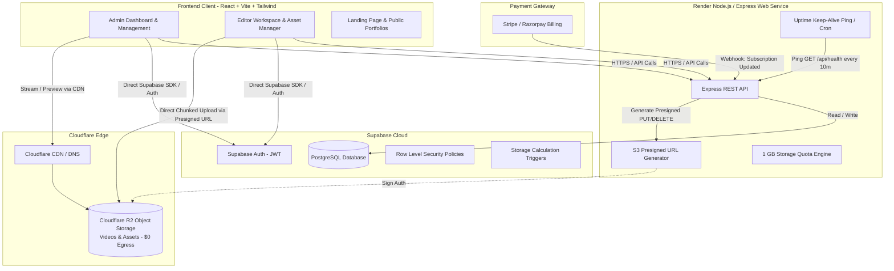
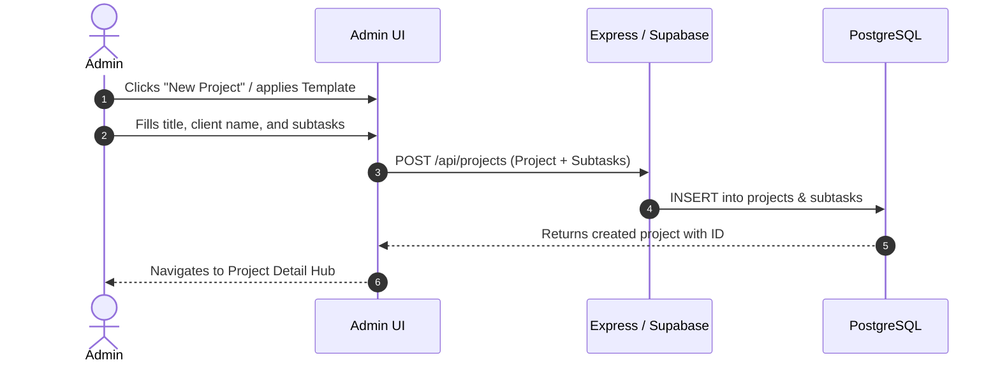
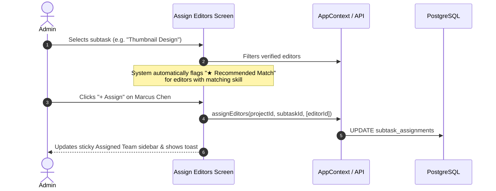
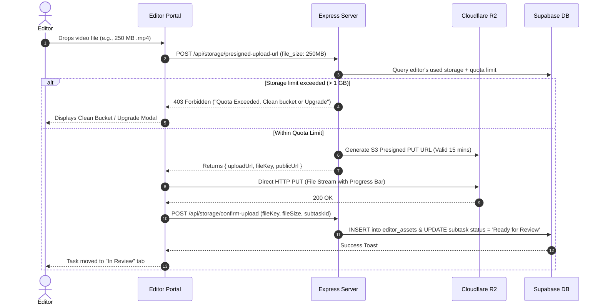
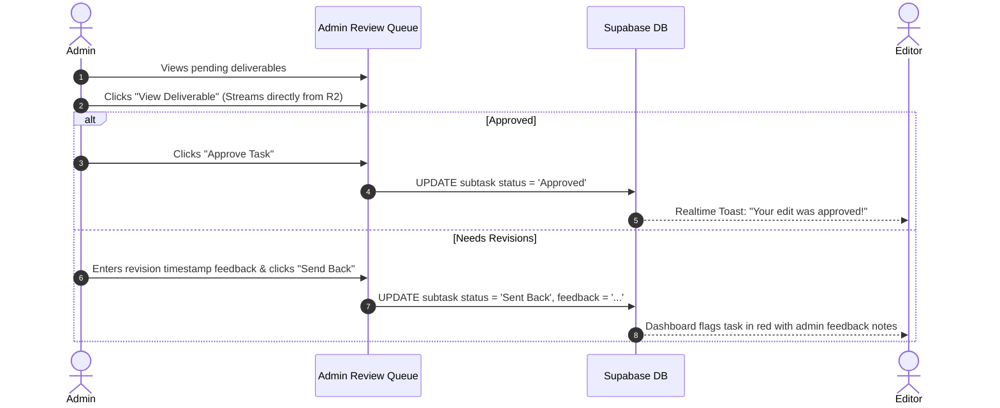
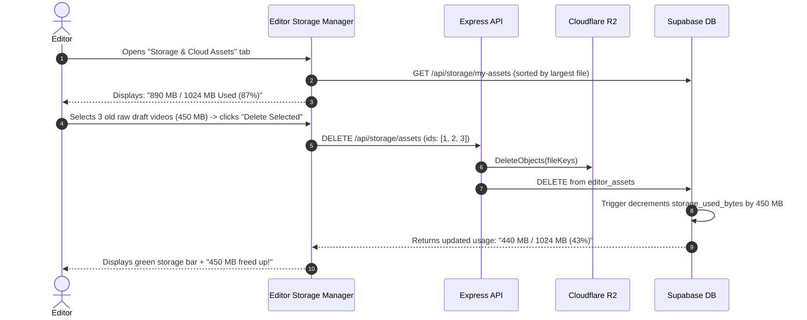

# 🏛️ Gogangs System Architecture & Flow Specification

This document provides a technical specification of the entire **Gogangs** video editing marketplace platform, covering infrastructure architecture, data flow, storage quota management, and user workflows.

---

## 1. High-Level Architecture Diagram



---

## 2. Infrastructure Components Breakdown

### 2.1 Frontend (SPA)
- **Framework**: React 18 + TypeScript + Vite + Tailwind CSS.
- **Hosting**: Vercel or Cloudflare Pages (Global edge CDN).
- **Authentication**: `@supabase/supabase-js` managing JWT sessions, refresh tokens, and role-based client routing.
- **Direct Uploads**: Uses `@aws-sdk/client-s3` (or direct `fetch` PUT) to upload video files directly to Cloudflare R2 via presigned URLs.

### 2.2 Backend API (Render Web Service)
- **Framework**: Node.js + Express 5 (ES Modules).
- **Hosting**: Render Free Web Service.
- **Keep-Alive Solution**: External HTTP cron (*UptimeRobot / Cron-Job.org / Supabase pg_cron*) pinging `/api/health` every 10 minutes to prevent the 15-minute free-tier spin-down.
- **Responsibilities**:
  - Issue Cloudflare R2 presigned upload/delete URLs.
  - Enforce the **1 GB storage quota limit** before issuing upload tokens.
  - Process Stripe/Razorpay billing webhooks for storage upgrades.
  - Handle admin-level batch tasks and aggregation endpoints.

### 2.3 Database & Realtime (Supabase PostgreSQL)
- **Engine**: Managed PostgreSQL 15.
- **Security**: Row Level Security (RLS) enabled on all tables.
- **Storage Metrics**: Database triggers compute `storage_used_bytes` automatically on insert/delete in the `editor_assets` table.

### 2.4 Object Storage (Cloudflare R2)
- **Format**: S3-compatible object storage.
- **Why R2**: **$0 Egress Fees** allows video streaming and reviewing without incurring high bandwidth bills.
- **Storage Structure**:
  ```
  bucket-name/
  ├── editors/{editor_id}/
  │   ├── portfolio/{file_id}.mp4
  │   └── subtasks/{subtask_id}/{file_id}.mp4
  ```

---

## 3. End-to-End User Workflows

### 3.1 Campaign & Subtask Creation Flow (Admin)


### 3.2 Smart Assignment Flow (Admin)


### 3.3 Video Upload & Direct Cloudflare R2 Submission Flow (Editor)


### 3.4 Review, Feedback & Approval Flow (Admin)


### 3.5 1 GB Bucket Cleanup Flow (Editor)

